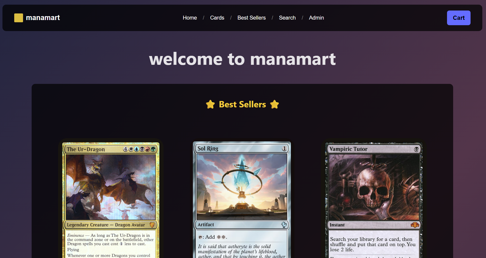
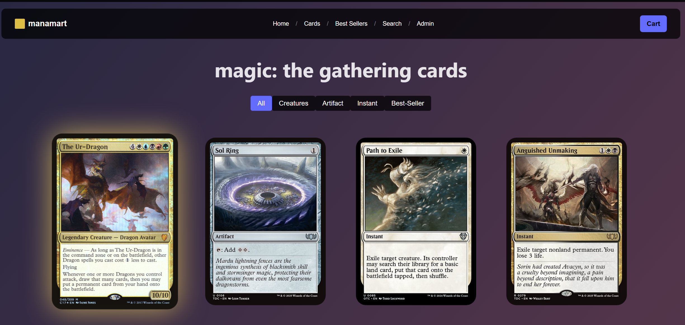
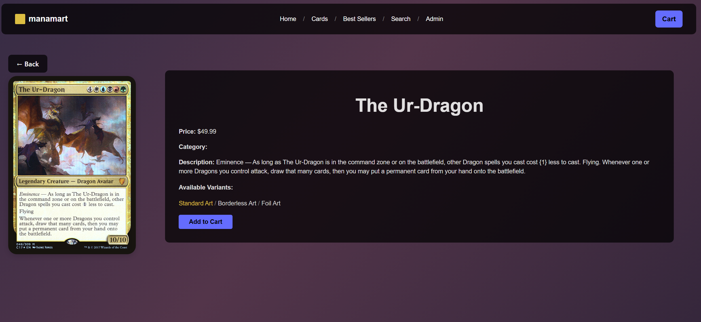
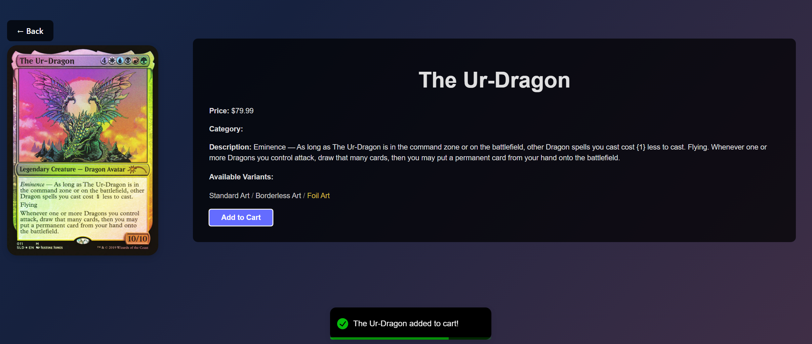
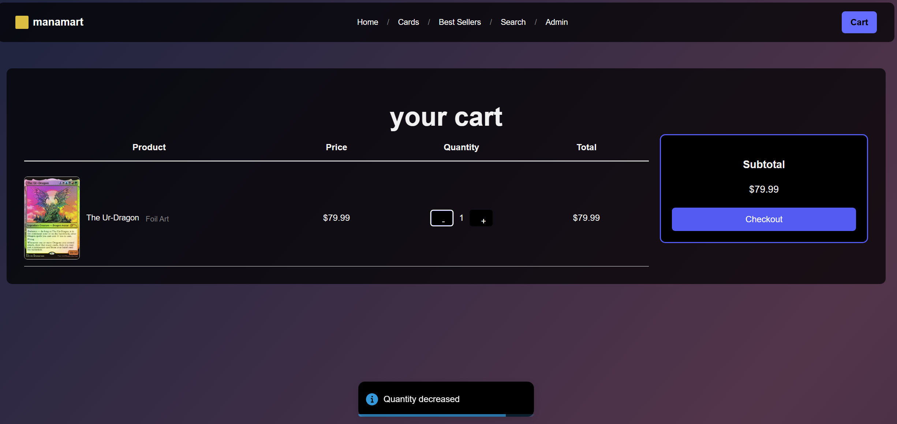
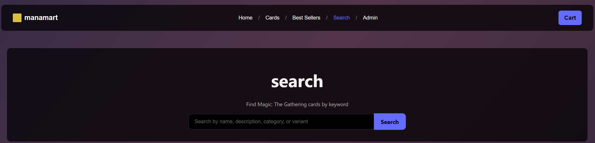
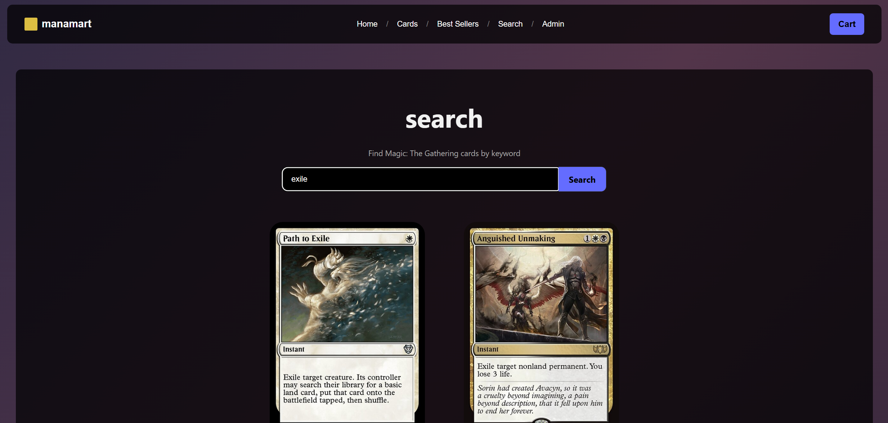
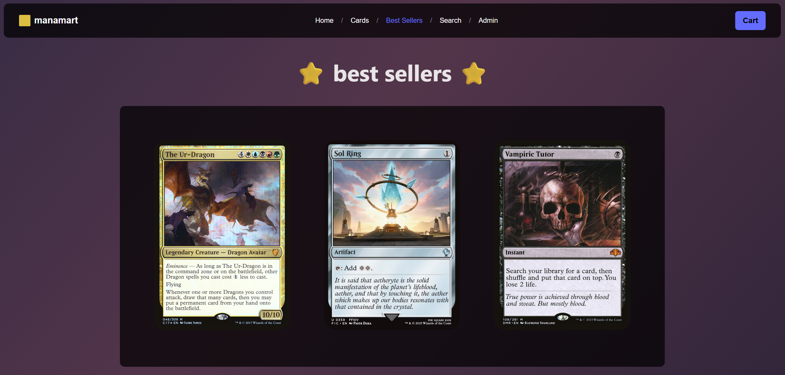
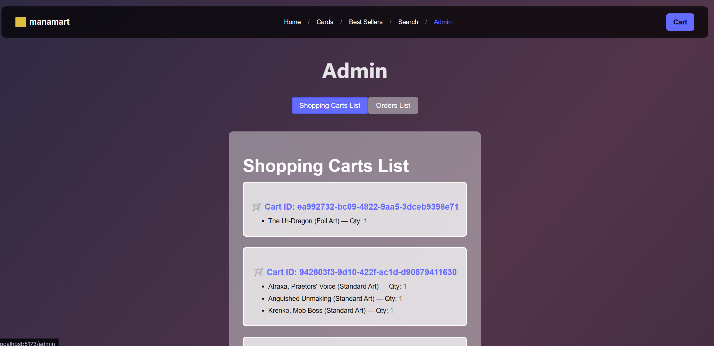
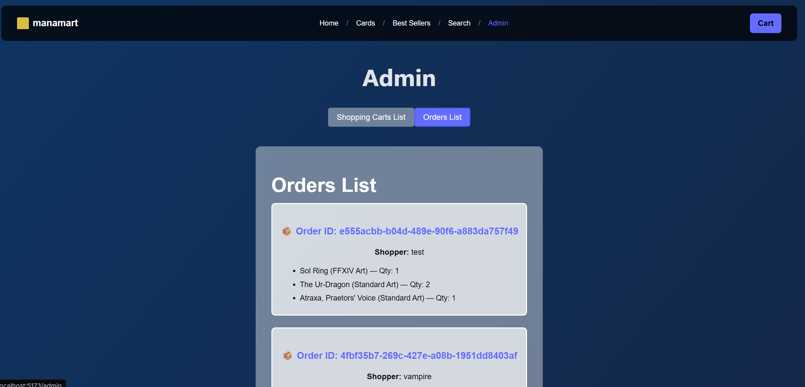

# manamart
### Magic: The Gathering E-Commerce Platform

Manamart is a full-stack e-commerce web application for buying and managing Magic: The Gathering cards.
The application demonstrates full-stack development, RESTful API design, database modeling, state management, 
search functionality, admin tooling, and Docker-based deployment.

---
## Overview
### Frontend
- React + Vite
- JavaScript
- CSS
- Client-side routing
- UI animations & feedback pop-ups

### Backend
- Node.js + Express
- MongoDB + Mongoose
- RESTful API architecture

### DevOps
- Docker (multi-container setup for frontend, backend, and database)

---

## Key Features

### Frontend
- Browse and view detailed card pages
- Keyword-based search (name, description, category, variant)
- Dynamic shopping cart system
- Order placement functionality
- Admin dashboard displaying active carts and placed orders
- Responsive UI with interactive animations

## Backend
- Modular backend structure (models, routes, scripts)
- MongoDB schema design for cards, carts, and orders
- Backend query logic supporting flexible search
- State synchronization between frontend and backend
- Fully containerized environment using Docker for reproducible setup

---

## Screenshots

### Home Page
Landing page showcasing featured products and navigation.

---

### Browse Cards
View all available Magic: The Gathering cards.

---

### Card Details
Individual card page displaying card information and purchase options.

---

### Shopping Cart
Dynamic cart with real-time updates before checkout.

---

### Search Functionality
Keyword-based search across name, description, category, and variant.

---

### Best Sellers
Highlighted top-performing or featured cards.

---

### Admin Dashboard
Administrative view of active shopping carts and placed orders.

---

## Docker instructions:

`docker compose up` in the root directory. Please wait till the mongoDB server is running.